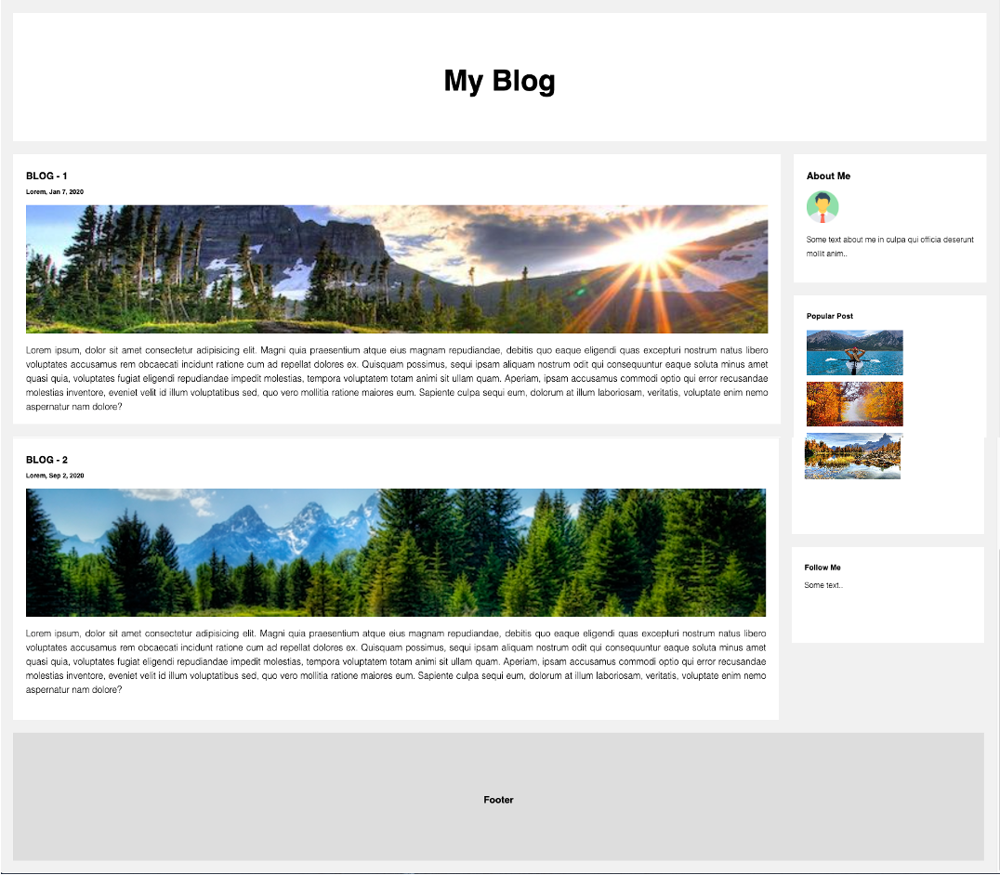
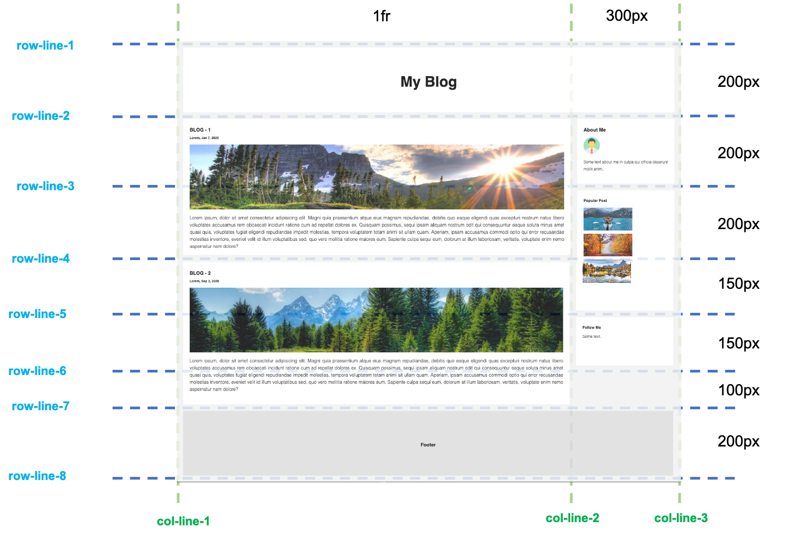

# Grid Blogger - LÖSUNG

Benutzt CSS Grid und baut die Blog Startseite nach. Orientiert euch am mockup -

## Layout design

Folgende Werte könnt ihr benutzen um das "mockup" nachzubauen:

## The online version

Hier findet ihr eine live Version der Seite --> [click...!](https://hsnakk.github.io/UIB_Layout_Grid_Exercise-2/)

# Bonus 
- Macht die Seite responsiv (nicht in der live Version enthalten!)
